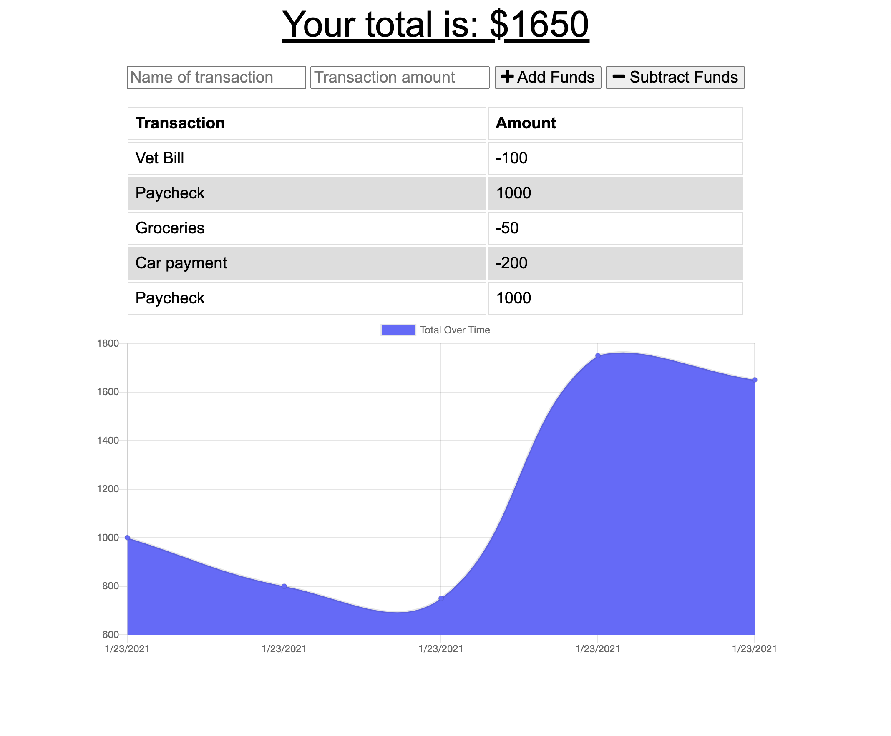

# Online Offline Budget Tracker

Explore the [project page](https://github.com/cynthiwu/online-offline-budget-tracker)

View it live on [Heroku](https://safe-river-31186.herokuapp.com/)

## Table of Contents
- [About The Project](#about-the-project)
    - [Built With](#built-with)
- [Installation](#installation)
- [Usage](#usage)
  - [Demo](#demo)
- [Contributing](#contributing)
- [Contact](#contact)


## About The Project

The goal of this project was to build out the backend of the Budget Tracker Application to allow for offline access and functionality. 

A user of the Budget Tracker will be able to add expenses and deposits to their tracker with or without a connection. When entering transactions offline, the total will be populated when brought back online.

<hr>



<hr>

### Built With

This project was built using:

* JavaScript
* [Node.js](https://nodejs.org/api/fs.html)
* [Express.js](https://expressjs.com/)
* [Morgan](https://www.npmjs.com/package/morgan)
* [MongoDB](https://www.mongodb.com/)
* [Mongoose](https://mongoosejs.com/)
* Service Worker


## Installation

While not necessary to run the program via the live link above, you may get a local copy up and running by following these simple steps:

1. Clone the repo
```sh
git clone git@github.com:cynthiwu/online-offline-budget-tracker.git 
```

2. Install NPM packages (i.e., Inquirer)
```sh
npm install
```

## Usage

This project can be used to and tracked deposits and expenses into an online Budget Tracker. When going offline, the tracker will continue to track budget changes, updating the database upon reconnection.

### Demo

Watch the video below to see how the program works.


## Contributing

Contributions are what make the open source community such an amazing place to  learn, inspire, and create. Any contributions you make are **greatly appreciated**.

1. Fork the Project
2. Create your Feature Branch (`git checkout -b feature/AmazingFeature`)
3. Commit your Changes (`git commit -m 'Add some AmazingFeature'`)
4. Push to the Branch (`git push origin feature/AmazingFeature`)
5. Open a Pull Request

## Contact

Cynthia Wu - [@cynthia21wu](https://twitter.com/cynthia21wu) - cynthia21wu@gmail.com

Project Link: [https://github.com/cynthiwu/online-offline-budget-tracker](https://github.com/cynthiwu/online-offline-budget-tracker)

Live Link: [https://safe-river-31186.herokuapp.com/](https://safe-river-31186.herokuapp.com/)
